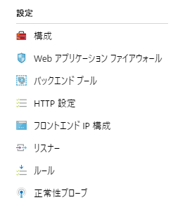
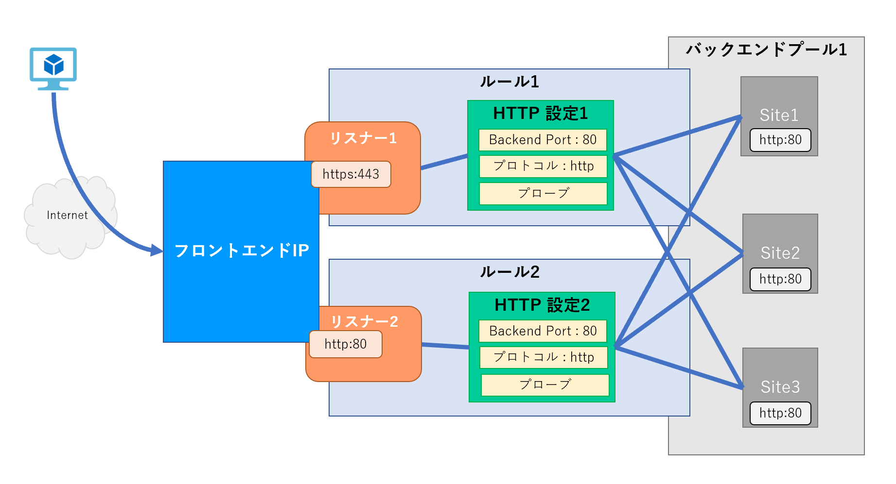
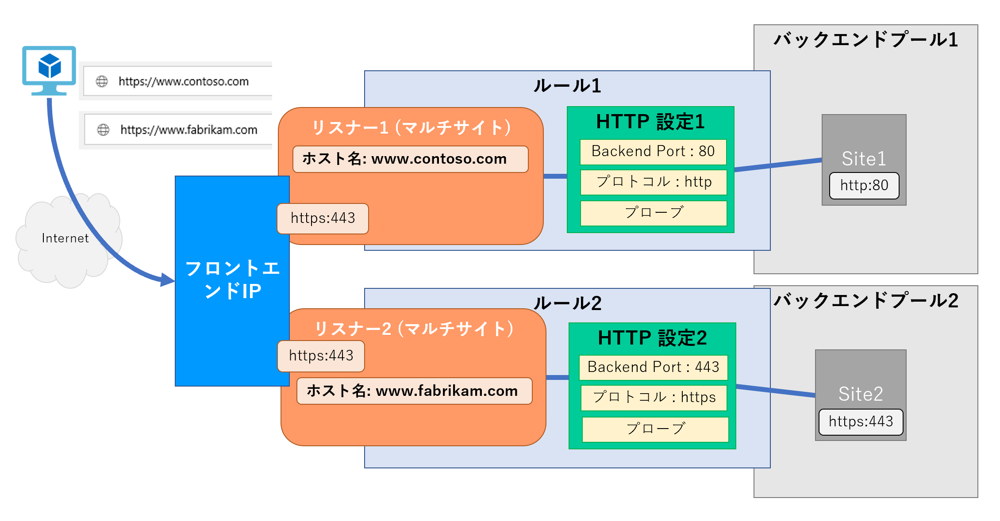
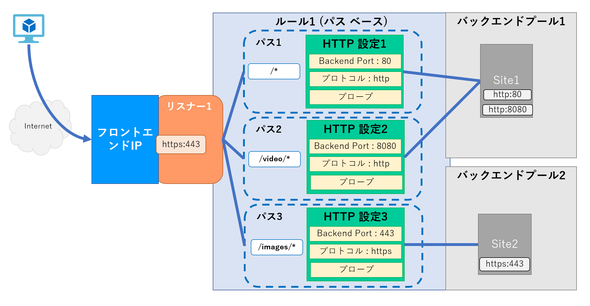
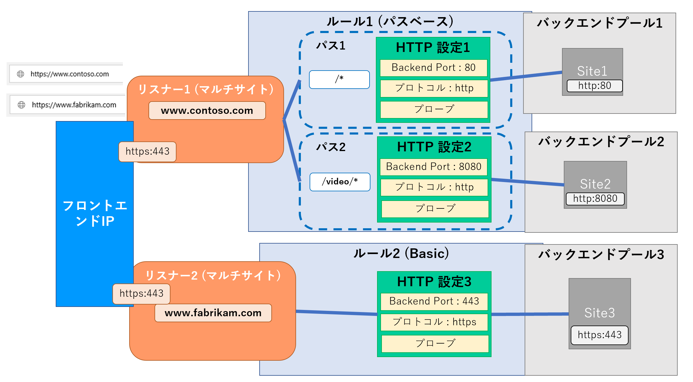
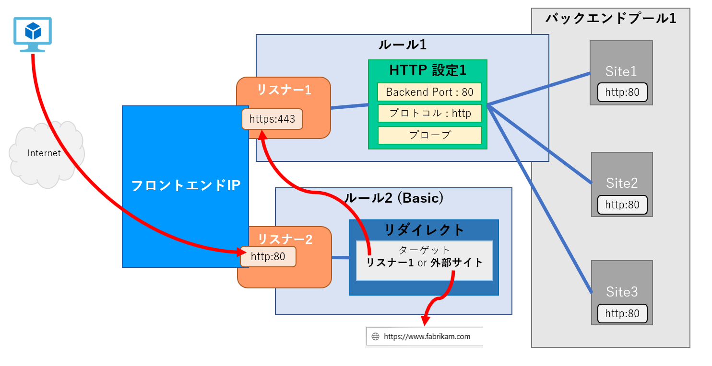

2019/2/27 追記
Application Gateway で EV 証明書がサポートされるようになりましたので、FAQ の内容を更新しております。

こんにちは、Azure テクニカル サポート チームの檜山です。
今回は Application Gateway の構成についてご紹介させていただきます。

また、下部に Application Gateway の FAQ もまとめてますので、ご参照ください。
Application Gateway はレイヤー 7 のロードバランサーで Web トラフィックを負荷分散することができますが、構成によっては設定が多岐にわたる場合があり、設定項目と実際の動作がイメージしにくいことがございます。
そのような時には、こちらのブログをご一読いただけますと幸いです。

Application Gateway の設定項目の概要と代表的な構成を以下に記載します。

1. [設定項目の概要](#1)
1. [Basic 構成](#2)
1. [マルチサイト](#3)
1. [パスベースでの振り分け](#4)
1. [マルチサイト&パスベース](#5)
1. [リダイレクト](#6)

- [FAQ](#7)

## ■ 設定項目の概要
Application Gateway には主に以下の 7 つの設定項目があります。

1. **構成**
   Application Gateway の SKU サイズ、インスタンス数を指定可能です。
   運用環境においては SKU サイズ M 以上、インスタンス数 2 以上が推奨となります。
   インスタンス数が 1 の場合、メンテナンスや障害等で予期せず停止する場合がございますので、ご注意ください。

1. **Web アプリケーション ファイアウォール**
   WAF の設定を行います。ファイアウォールのモードやルールの設定が可能です。
   WAF については以下もご参照ください。
   [Application Gateway (WAF) での脆弱性検知について](https://jpaztech.github.io/blog/archive/application-gateway-waf-vulnerability-detection/)

1. **バックエンドプール**
   リクエストを振り分ける先となるバックエンドの Web サーバーを設定します。
   仮想マシン、IP アドレス、FQDN 等を指定することができます。 IP アドレス、FQDN については Azure 外部の Web サイトを設定することもできます。

1. **HTTP 設定**
   バックエンドプールに接続する際のパラメーターを設定します。
   バックエンドに接続するポートやプロトコル (http/https) 、カスタム プローブの指定などを行います。

1. **フロントエンド IP 構成**
   Application Gateway がクライアントからリクエストを受け付けるためのパブリック IP アドレスまたはプライベート IP アドレスを設定します。
   フロントエンド IP アドレスはパブリック IP, プライベート IP 共に最大 1 つずつです。

6. **リスナー**
   Application Gateway がクライアントからリクエストを受け付けるためのフロントエンド IP の指定とフロントエンドのポート、プロトコル (http/https) を設定します。
   https の場合、証明書の設定も行います。
   マルチサイト リスナーを構成することでリクエストのホストヘッダに応じて負荷分散を行うことが可能です。

7. **ルール**
   上記の "リスナー"、"バックエンドプール"、"HTTP 設定" の紐づけを行います。
   パスベースのルールを構成することで、URL のパスに応じてバックエンド プールと HTTP 設定を変えることも可能です。
   また、URL のリダイレクトを構成することもできます。

8. **正常性プローブ**
   既定のプローブ以外のカスタム プローブを使用する場合に設定を行います。
   カスタム プローブを構成することで、正常性プローブのホストヘッダやパスを指定することができます。

## ■ Basic 構成
Azure Portal から作成した際の初期設定は Basic 構成となります。
このままでも利用可能ですが、次の項目に記載するマルチサイトやパスベース、リダイレクトの要件があった場合、ルールを追加または変更する必要があります。

以下の例は 2 つのルールが構成されています。
ルール 1 : https (443) で受け付けたリクエストを http (80) に SSL オフロードするルール
ルール 2 : http (80) で受け付けたリクエストをそのまま転送するルール

## ■ マルチサイト
マルチサイト リスナーを構成することで、クライアントがアクセスする URL のホスト名 (HTTP のホストヘッダ) に応じて振り分け先を変えることができます。
以下の例の動作をご説明します。

クライアントが "https://www.contoso.com" にアクセスした場合、http (80) で Site1 にアクセスします。
クライアントが "https://www.fabrikam.com" にアクセスした場合、 https (443) で Site2 にアクセスします。

なお、ルールが複数構成されている場合、ルールは上から順 (先に作成されたもの順) に照合されます。
マルチサイト リスナーが含まれるルールと Basic リスナーが含まれるルールを両方構成する場合、マルチサイト リスナーが含まれるルールを先に作成することを推奨します。
Basic リスナーを含むルールを先に作成すると、マルチサイト リスナーが想定したとおりに動作しない可能性があります。

## ■ パスベースでの振り分け
パスベースのルールを作成することで URL のパスに応じて HTTP 設定やバックエンドを変更することができます。
以下の例の動作をご説明します。

クライアントが "https://xxxxx/" にアクセスした場合、http (80) で Site1 にアクセスします。
クライアントが "https://xxxxx/video/" にアクセスした場合、http (8080) で Site1 にアクセスします。
クライアントが "https://xxxxx/images/" にアクセスした場合、https (443) で Site2 にアクセスします。

## ■ マルチサイト&パスベース
以下の様にマルチサイト リスナーとパスベースのルールを組み合わせて、URL のホスト名とパスに応じて HTTP 設定、バックエンドを変更することもできます。
以下の例の動作をご説明します。

クライアントが "https://www.contoso.com/" にアクセスした場合、http (80) で Site1 にアクセスします。
クライアントが "https://www.contoso.com/video/" にアクセスした場合、http (8080) で Site2 にアクセスします。
クライアントが "https://www.fabrikam.com/" にアクセスした場合、https (443) で Site3 にアクセスします。

## ■ リダイレクト
Application Gateway は受け取ったリクエストを他のリスナーや外部サイトにリダイレクトすることができます。
例えば http で受け付けたリクエストを https にリダイレクトすることも可能です。

以下の例の動作をご説明します。

【リダイレクトがリスナー 1 向けに構成されている場合】
クライアントが http (80) でアクセスしたリクエストを https (443) へリダイレクトします。

【リダイレクトが外部サイト向けに構成されている場合】
クライアントが http (80) でアクセスしたリクエストを "https://www.fabrikam.com" へリダイレクトします。

## ■ FAQ
以下の FAQ は V2 SKU ではない SKU (Standard, WAF) のApplication Gateway を対象に記載しておりますのでご留意ください。

- **Application Gateway のフロントエンド IP アドレス (パブリック) を固定 IP にできますか。**
  フロントエンドのパブリック IP アドレスは動的な IP アドレスのみがサポートされております。
  パブリック IP アドレスが変更されるタイミングは、Application Gateway を停止、再起動した場合、および Application Gateway 自体を削除し、再作成したタイミングとなります。
  Azure 側のメンテナンス等で変更されることは想定されておりません。
  
  パブリック IP アドレスの変更に対応する方法としては、フロントエンド IP アドレスに割り当たる DNS 名 (xxxx.cloudapp.azure.com) の CNAME エイリアスを構成することを推奨しております。
  パブリック IP に割り当てられる DNS 名は、Application Gateway を停止、起動しても変更されることはございません。

- **Application Gateway へ接続する接続元を制限することができますか。**
  Application Gateway を配置する仮想ネットワークのサブネットにネットワーク セキュリティ グループ (NSG) を適用し、接続元を制限することができます。
  NSG は FQDN での制限や地理的リージョンでの IP アドレス制限には対応しておりませんので、ご留意ください。

  NSG のルールは以下を参照ください。
  ネットワーク セキュリティ グループはアプリケーション ゲートウェイ サブネットでサポートされますか?
  [https://docs.microsoft.com/ja-jp/azure/application-gateway/application-gateway-faq#are-network-security-groups-supported-on-the-application-gateway-subnet](https://docs.microsoft.com/ja-jp/azure/application-gateway/application-gateway-faq#are-network-security-groups-supported-on-the-application-gateway-subnet)

  Application Gateway へ接続すると 502 エラーが表示されます。
  以下にも関連情報がございますので、ご確認ください。

  Application Gateway における 502 Error について
  [https://blogs.technet.microsoft.com/jpaztech/2018/03/16/application-gateway-502-error-info/](https://blogs.technet.microsoft.com/jpaztech/2018/03/16/application-gateway-502-error-info/)

- **ラウンドロビンでの負荷分散は可能でしょうか。**
  Application Gateway は既定でラウンドロビンで負荷分散が行われます。
  ユーザーセッションを維持したい場合は HTTP 設定にて Cookie ベースのセッション アフィニティを有効化する必要があります。

- **Sorry ページを構成することは可能でしょうか。**
  以下のエラーページについてはカスタムのエラーページを構成することができます。
  - HTTP 502（Bad Gateway)
  - HTTP 403（Forbidden）

  Application Gateway のカスタム エラー ページを作成する
  [https://docs.microsoft.com/ja-jp/azure/application-gateway/custom-error](https://docs.microsoft.com/ja-jp/azure/application-gateway/custom-error)

  ただし、カスタムエラーページは BLOB に配置された静的なサイトのみがサポートされています。

- **EV 証明書を利用できますか。**
  Application Gateway で EV 証明書はサポートされております。

  What certificates are supported on Application Gateway?
  [https://docs.microsoft.com/en-us/azure/application-gateway/application-gateway-faq#what-certificates-are-supported-on-application-gateway](https://docs.microsoft.com/en-us/azure/application-gateway/application-gateway-faq#what-certificates-are-supported-on-application-gateway)

 
以上、参考になれば幸いです。
