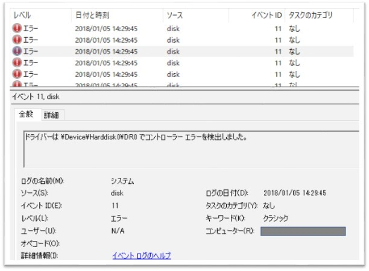

※ 2018/02/01 更新
修正版の MARS Agent が公開されましたので、更新方法を追記いたしました。

こんにちは、Azure IaaS Support チームです。

本日は 1 月 4 日に発生しましたメンテナンスによる仮想マシンの再起動以降、Azure VM で MARS Agent によるファイルとフォルダーのバックアップが「仮想ディスク サービスで予期しないエラーが発生したため、バックアップを開始できませんでした。 I/O デバイス エラーが発生したため、要求を実行できませんでした。 (0x8007045D)」のメッセージで失敗する弊社製品不具合の事象についてご案内いたします。

※ 本情報の内容（添付文書、リンク先などを含む）は作成日時点でのものであり、予告なく変更される場合があります。

## ■ 事象について

MARS Agent による Azure VM のファイルとフォルダーのバックアップが下記イベント ID 11 の記録とともに失敗します。

当該事象はバックアップ取得時に作成される VHD ファイルのマウント/アンマウントの内部処理に問題があり、IO エラー (0x8007045D) が返されることでバックアップが失敗します。
根本原因としては、Agent の処理に問題があることが分かっており現在 Microsoft 開発チームにて修正対応が進められております。

## ■ 対処策
本事象につきましては、回避策としてキャッシュの場所変更がございます。
VM に OS ディスク以外のデータ ディスクが接続されている場合にはキャッシュの場所変更についてご検討をいただけますようお願いいたします。
また、2018 年 1 月 23 日時点で Private Fix が公開されておりますので、上記対処策の実施が難しい場合には Private Fix の適用についてご検討を頂ければと存じます。

 
### キャッシュの場所変更方法

1. タスク マネージャー (Ctrl + Shift + Esc キー) を起動し、[サービス] タグの「obengine (Microsoft Azure Recovery Services Agent)」を停止します。

2. 現在のスクラッチ フォルダーのバックアップ対象ファイルやフォルダーを十分な空き容量のあるスクラッチ フォルダーへコピーします。
   (規定 C:\Program Files\Microsoft Azure Recovery Services Agent\Scratch)
      ↓
   (例えば E:\Scratch など)

3. 新しい Scratch フォルダーへ既定の Scratch フォルダー内にある OnlineBackup.KEK ファイルをコピーします。

4. レジストリ エディター (スタートボタン ＋ R キーし、「regedit」と入力) を起動し、以下設定を手順 2 と同じ場所に変更します。
   レジストリ パス :
      HKEY_LOCAL_MACHINE\SOFTWARE\Microsoft\Windows Azure Backup\Config
      HKEY_LOCAL_MACHINE\SOFTWARE\Microsoft\Windows Azure Backup\Config\CloudBackupProvider

   レジストリ キー :
   ScratchLocation

5. バックアップを実行します。

## ■ 参考

Azure Backup サービスについての質問
[https://docs.microsoft.com/ja-jp/azure/backup/backup-azure-file-folder-backup-faq#backup](https://docs.microsoft.com/ja-jp/azure/backup/backup-azure-file-folder-backup-faq#backup)
参考箇所 : \[バックアップ\] の "Azure Backup エージェント用に指定されたキャッシュの場所を変更する方法を教えてください。"

### Private Fix 適用方法について

1. タスク マネージャー (Ctrl + Shift + Esc キー) を起動し、[サービス] タグの「obengine (Microsoft Azure Recovery Services Agent)」を停止します。

2. Agent を最新の 2.0.9105.0 のバージョンにアップデートします。
    1. URL (https://aka.ms/azurebackup_agent) より最新版の MARS エージェントをダウンロードします。 
    2. ダウンロードした "MARSAgentInstaller.exe" を対象のサーバーで実行します。
    3. 更新プログラムをインストールするかの画面では [次へ] をクリックします。
    4. インストールの画面で必要なソフトウェアのアップグレードをするかメッセージが表示されますので、[アップグレード] をクリックします。
    5. アップグレードが完了した事を確認し [完了] をクリックします。

3. 下記からダウンロードした最新版の VhdFileProvider.dll ファイルを既存のものと置き換えます。
   [VhdFileProvider](http://blogs.technet.microsoft.com/jpaztech/2018/01/23/__trashed/vhdfileprovider/)
   既定のパス C：\Program Files\Microsoft Azure Recovery Services Agent\bin\VhdFileProvider.dll
   ※ 元々の VhdFileProvider.dll ファイルは任意の場所に保管をお願いします。

4. バックアップを実行します。
   ※ 最初のバックアップは下記メッセージが表示され失敗する可能性がございます。
   ※ これは、キャッシュ ロケーションを含むディスクのエラーが原因でございます。
>「バックアップが失敗しました。これは、Azure Backup が設定されたキャッシュ ロケーションでメタデータ vhd を準備できなかったためです。」

5. 別のバックアップをトリガーし、再度バックアップを取得します。

 

## ■ 修正情報 (2018/02/01 更新)
※ 2018/02/01  時点で最新版の MARS Agent (2.0.9109.0) が公開されました。

### 最新版の MARS エージェントへのアップデート方法について
1. 最新版の MARS エージェントをダウンロードします。
2. ダウンロードした "MARSAgentInstaller.exe" を対象のサーバーで実行します。
3. 更新プログラムをインストールするかの画面では [次へ] をクリックします。
4. インストールの画面では必要なソフトウェアのアップグレードをするかのメッセージが表示されますので、[アップグレード] をクリックします。
5. アップグレードが完了した事を確認し [完了] をクリックします。

以上でアップデートは完了です。

バックアップを実行時にエージェントのアップデートを実施した場合には、現在進行しているバックアップ処理はキャンセルされ、アップデート完了後、再度バックアップ処理が開始されます。尚、イベント ログ情報においてジョブの結果は失敗となります。

### ※ 注意点

- バックアップ操作または復元操作が実行中でないことを確認してください。実行中の操作はすべて取り消されます。
- バックアップに使用される管理コンソールが閉じていることを確認してください。
- 実行中のレプリケーション操作は更新中にすべて取り消されます。これらの操作は、更新が完了すると再開されます。
- スケジュールされたバックアップが、更新プログラムの適用中に実行された場合、バックアップ ジョブは失敗します。

