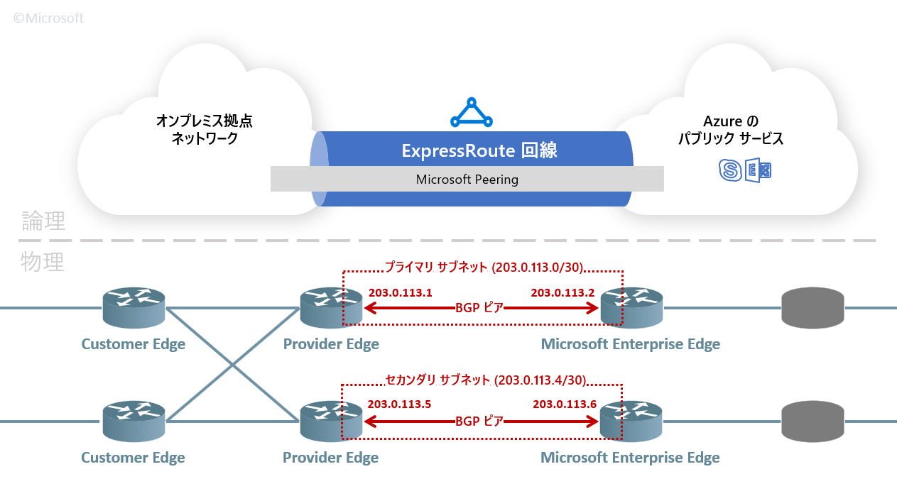

Azure Networking テクニカル サポートの山口です。

Azure のネットワークとオンプレミス拠点ネットワークを直接接続する ExpressRoute と呼ばれるサービスがあります。ExpressRoute では利用目的に応じた複数のピアリング方法が用意されているのですが、今回は Microsoft Peering と呼ばれるピアリング サービスについて注目して、その構築時に留意いただく必要のあるポイントをいくつかご紹介したいと思います。

<!-- more -->

## Microsoft Peering とは何か

ExpressRoute は、オンプレミスと Azure のネットワークをインターネットを介さずに直接接続するためのサービスです。ExpressRoute 回線と呼ばれる Azure リソースを作成し、その中にピアリング情報を構成することで利用できます。

接続先に応じて下記 2 種類のピアリング種類が用意されており、ひとつの ExpressRoute 回線上に両ピアリングを同時に構成することもできます。

* **Private Peering**: 仮想ネットワークとの接続 (Azure 上の Private IP 帯との接続)
* **Microsoft Peering**: Azure のパブリック サービス / O365 との接続 (Azure のパブリック IP 帯との接続)

※ 以前はこの他に Public Peering と呼ばれる種別もありましたが、現在は Microsoft Peering に統合されています。

* [ExpressRouteのPublicPeeringとMicrosoftPeeringに関するアナウンス](https://jpaztech1.z11.web.core.windows.net/ExpressRoute%E3%81%AEPublicPeering%E3%81%A8MicrosoftPeering%E3%81%AB%E9%96%A2%E3%81%99%E3%82%8B%E3%82%A2%E3%83%8A%E3%82%A6%E3%83%B3%E3%82%B9.html)

今回の記事では、**Microsoft Peering** と呼ばれるピアリング種別についてお話します。ExpressRoute 回線で Microsoft Peering を構成すると、オンプレミス拠点から Azure 上のパブリックなサービスに回線経由で接続できます。

例えば、BLOB ストレージへのバックアップ通信を ExpressRoute 回線経由とすることが出来ます。

## 物理的レイヤー

高レベルな概念としては、オンプレミス拠点と Azure のネットワークを接続するイメージで間違いないのですが、具体的にルーターのレベルで何をやっているか落とし込むと下図のようになります。

まず用語を整理すると、次の通りです。

* Microsoft Enterprise Edge (MSEE): Azure 側のエッジ ルーター
* Privider Edge (PE): プロバイダー側のエッジ ルーター
* Customer Edge (CE): お客様拠点のエッジ ルーター

Azure リソース上で 1 つの ExpressRoute 回線を作成すると、物理的には Azure 側のルーター (MSEE) が 2 つ確保される動作となっています。MSEE は Active/Active で動作するため、万が一片系に障害が発生しても引き続き通信が可能となります。

なお、ExpressRoute 回線の契約時に選択いただく帯域幅は、各 MSEE で同じだけ確保されます。例えば、200 Mbps を選択頂いた場合、プライマリ側の MSEE でもセカンダリ側の MSEE でも、それぞれ 200 Mbps が確保されます。

### BGP

PE と MSEE の間では、インターネットで一般的に用いられている動的な経路交換プロトコルの **BGPv4** (RFC4271) を利用して、お互いのネットワークの経路情報を交換、学習します。

BGP でピア (ネイバー) を張るには、PE と MSEE のそれぞれのインターフェイスに IP アドレスを割り当てる必要があり、Microsoft Peering ではこのアドレスをお客様側で準備いただく必要があります。PE と MSEE に払い出す IP アドレスが、セカンダリ/プライマリのそれぞれで必要な為、/30 のグローバル IP アドレスのプレフィクスが 2 つ必要です。

例えば、203.0.113.0/30 と 203.0.113.4/30 をサブネットに利用する場合は、先の図の通りに IP アドレスが払い出されます。つまり、予約済みでない利用可能 IP アドレスのうち、若番が PE 側に、老番が MSEE 側に払い出されます。`traceroute` を実行したときに MSEE が応答する IP アドレスの参考としていただければ幸いです。

### 経路広報

オンプレミス側から広報する経路情報は、基本的に、PE ルーターで NAT 用に確保しているアドレス プレフィクスです。後述の通り、この経路情報は `Advertised public prefixes` のパラメータで指定します。

例えば 203.0.113.0/28 をオンプレミス/プロバイダー側から広報すれば、Microsoft のパブリック サービスから 203.0.113.0/28 に宛てたパケットは、この ExprsesRoute 回線を経由してフォワーディングされる動作となります。このため、オンプレミス側から Azure への通信を 203.0.113.0/28 を SNAT することで、戻り通信が対称的に返ってくるようになります。

一方で、Azure 側から広報する経路情報は、**ルート フィルター (route filter)** と呼ばれる Azure リソースを利用で指定することが出来ます。逆に言えば、ルート フィルターで広報するまで、Azure 側からは一切経路が広報されません。

* [ExpressRoute:ルート フィルター - Microsoft ピアリング:Azure portal | Microsoft Docs](https://docs.microsoft.com/ja-jp/azure/expressroute/how-to-routefilter-portal)

### BGP コミュニティ

ルート フィルターでは、**BGP コミュニティ (BGP Community)** と呼ばれるアドレス プレフィクスの集合を単位として、目的のサービスに適したアドレス帯を Azure 側から広報することが出来ます。

選択できる BGP コミュニティの一覧は、以下の公式ドキュメントにまとまっています。

* [Azure ExpressRoute: ルーティングの要件 | Microsoft Docs](https://docs.microsoft.com/ja-jp/azure/expressroute/expressroute-routing#support-for-bgp-communities)

簡単に例を挙げると、東日本リージョンのリージョン BGP コミュニティ (12076:51012) をルートフィルターで選択すれば、東日本リージョンで利用しているすべてのパブリック IP アドレスとの通信が ExpressRoute 回線を経由するようになります。

### その他の参考情報

より詳細については、以下の公式ドキュメントやブログ等をご参考にしていただければ幸いです。

* [Azure ExpressRoute: 回線とピアリング | Microsoft Docs](https://docs.microsoft.com/ja-jp/azure/expressroute/expressroute-circuit-peerings#expressroute-peering)
* [よくあるご質問 (FAQ) - Azure ExpressRoute | Microsoft Docs](https://docs.microsoft.com/ja-jp/azure/expressroute/expressroute-faqs#microsoft-peering)
* [詳説 Azure ExpressRoute - Part1: ExpressRoute を導入する前に | Microsoft Docs](https://docs.microsoft.com/ja-jp/archive/blogs/jpaztech/expressroute-deep-dive-part1)

## 導入手順

Microsoft Peering は、大まかに以下の手順で構成いただけます。

1. ExpressRoute 回線リソースを作成
2. プロバイダー側でプロビジョニング作業を実施
3. Microsoft Peeirng の構成を実施
4. NAT アドレス利用の承認を待機
5. ルートフィルターを構成

Azure Portal 上での操作方法等は公式ドキュメントに記載されておりますので、詳細はこちらをご覧ください。

* [Azure ExpressRoute: ピアリングの構成 | Microsoft Docs](https://docs.microsoft.com/ja-jp/azure/expressroute/expressroute-howto-routing-portal-resource-manager#microsoft-peering)

続くセクションでは、導入に際してご留意いただく必要がある点を幾つかご紹介します。

### 注意点: プロビジョニング作業の要不要

まずはじめに注意が必要なのは、手順 2. のプロビジョニング作業です。多くの ExpressRoute 回線プロバイダーでは、回線のプロビジョニング作業を代行して実施するサービスを提供しており、その場合はお客様側で実際に作業が必要となる工程は存在いたしません (このような回線プロバイダーは、L3 プロバイダーと呼ばれることもあります)。

一方で、お客様側でルーターの管理/構成を実施する必要のある回線プロバイダー (L2 プロバイダーと呼ばれます) も存在します。L2 プロバイダーの場合は、インターフェイスへの IP の割り当て、BGP、経路広報の設定といったルーターの構成を、お客様ご自身で実施して頂く必要があります。お客様の所有するルーターの構成方法については弊サポートでご支援することが叶わない為、プロビジョニング時の技術支援に関しては、別途ベンダー様にお問い合わせいただく必要があります。

以下の弊社エンジニアによる発表スライド (p10--12) でも L2 / L3 プロバイダーの違いを簡単にご説明をしていますので、こちらも併せてご参考ください。

* [詳説 Azure ExpressRoute | 発表スライド](https://eventmarketing.blob.core.windows.net/mstechsummit2018-after/CI27_PDF_TS18.pdf)
* [[TS18] CI27 | 詳説 Azure ExpressRoute](https://www.youtube.com/watch?v=xBI-RA8wLqc)

### 注意点: Microsoft Peering 構成時のパラメータ

次に、手順 3. で Microsoft Peering 構成時に入力する項目 (パラメータ) についてです。

* [Azure ExpressRoute: ピアリングの構成 | Microsoft Docs](https://docs.microsoft.com/ja-jp/azure/expressroute/expressroute-howto-routing-portal-resource-manager#to-create-microsoft-peering)

基本的な説明は上記ドキュメント内に記載されていますが、特にご質問をいただくことが多いパラメータについて以下で簡単に説明させていただきます。

**アドバタイズされたパブリック プレフィクス (Advertised public prefixes)**:

オンプレミス側のルーターから広報するプレフィックスをご設定ください。10.x.x.x/28 等のプライベート IP アドレス (RFC 1918) は利用できず、ICANN や RIR から分配されたグローバル IP アドレスを利用する必要があります。
Microsoft Peering は、グローバル IP アドレス (いわゆるインターネット) の世界でルーティングを変更するサービスです。一般に、オンプレミス拠点のプライベート ネットワークからインターネットに出ていく際は、グローバル IP アドレスで SNAT する必要がありますが、その NAT アドレスのプールが `Advertised public prefixes` に該当することが一般的です。

**顧客 ASN (Customer ASN)**:

前述の `Advertised public prefixes` として設定されるパブリック IP アドレスが、Peer AS と異なる AS に所属している場合に設定が必要となる場合があります。例えば、PE ルーターではプロバイダーの AS 番号 (これは `Peer AS` と呼ばれるパラメータです) を利用し、`Advertised public prefixes` はお客様所有の AS (これが `Customer AS` です) のパブリック IP アドレスを利用する場合などが該当します。

**ルーティング レジストリ名 (Routing registry name)**:

BGP ハイジャッキングを防止する目的で、`Advertised public prefixes` がお客様所有のパブリック IP アドレスかを確認・検証しております。この検証時に RIR / IRR のデータベースを参照しますので、当該アドレスの割り当て元にあたる機関をご選択ください。

### 注意点: Advertised public prefixes の手動検証

選択したルーティング レジストリ (RIR/IRR) のデータベースに `Advertised public prefixes` が存在しない場合、システムによる自動検証が失敗します。この場合、サポート窓口お問い合わせをいただくことで、担当部門で手動の検証を実施することが出来ます。

* [Azure ExpressRoute: ピアリングの構成 | Microsoft Docs](https://docs.microsoft.com/ja-jp/azure/expressroute/expressroute-howto-routing-portal-resource-manager#to-create-microsoft-peering)

> '検証が必要です' というメッセージが表示された場合は、ルーティング レジストリにプレフィックスの所有者として一覧表示されているエンティティによって組織にパブリック プレフィックスが割り当てられていることを示すドキュメントを収集し、下に示すようにサポート チケットを開くことにより、これらのドキュメントを手動検証のために送信してください。

お問い合わせの際には、承認を受ける ExpressRoute 回線を対象製品としてご選択ください。また、手動検証には以下の 5 つの情報が必要となりますので、こちらの情報を含めてご起票いただければスムーズに手動検証が実施出来ます。

* ExpressRoute 回線のサービス キー
* ExpressRoute 回線をデプロイしたリージョン
* `Advertised public prefixes` (オンプレミス拠点から広報するパブリック IP アドレス)
* `Peer ASN` (MSEE と BGP ピアを張る AS 番号。`Customer ASN` ではありません)
* `Advertised public prefixes` を `Peer ASN` で利用出来ることを示す証跡。例えば、他社様から借り受けたグローバル IP アドレスであれば、借り受けたことを示すメールの文面や pdf の文書等が該当します

### 注意点: O365 利用時の承認について

BGP コミュニティのうち、"その他の Office 365 Online サービス" (12076:5100) を選択するには、事前に Microsoft から承認を受ける必要があります。

* [Azure ExpressRoute: ルーティングの要件 | Microsoft Docs](https://docs.microsoft.com/ja-jp/azure/expressroute/expressroute-routing#service-to-bgp-community-value)

> ** Microsoft からの承認が必要です。「Microsoft ピアリングにルート フィルターを構成する\」を参照してください

承認のフォームは以下のリンクから提供しておりますが、フォーム冒頭にも記載がある通り、法的規制などにより閉域網接続の正当性が認められる金融機関などのお客様を除いては、原則申請は承認されない点については予めご留意ください。

* [ExpressRoute for Office 365 Request Form](https://forms.office.com/Pages/ResponsePage.aspx?id=v4j5cvGGr0GRqy180BHbRyOZxByRF1dLgv7k6ye5z8pUQkdLRTQ5QkcyOTU3VkNEOFdOWk9IRDZTUy4u)

> Microsoft authorization is required to use ExpressRoute for Office 365. Microsoft reviews every customer request and authorizes ExpressRoute for Office 365 usage when a customer's regulatory requirement mandates direct connectivity. If you have such requirements, please provide the text excerpt and web link to the regulation which you interpret to mean that direct connectivity is required in the ExpressRoute for Office 365 Request Form to begin a Microsoft review. 
>
> (抄訳)
> ExpressRoute for Office 365 のご利用には Microsoft による承認が必要です。
> Microsoft では、お客様の申請を検証して、閉域網での接続がお客様の規制要件によって義務付けられていると判断した場合に限り、ExpressRoute for Office 365 の使用を承認しています。
> そのような要件がある場合は、ExpressRoute for Office 365 リクエスト フォームにて、閉域網接続が必要であることを示す規制文章の抜粋や Web リンクを提供してください。

## Microsoft Peering に関する FAQ

最後に、頻繁にお問い合わせをいただくものの、公式ドキュメントには掲載のないご質問について簡単に回答を掲載させていただきます。

公式ドキュメントの FAQ ページは以下からアクセス出来ますので、こちらも併せてご参考としていただければと思います。

* [よくあるご質問 (FAQ) - Azure ExpressRoute | Microsoft Docs](https://docs.microsoft.com/ja-jp/azure/expressroute/expressroute-faqs)

以下でも解決できないご不明点等がありましたら、ご利用の ExpressRoute 回線を対象製品として選択いただき、弊社技術サポートまでお問い合わせいただければ幸いです。

### Q. 選択すべき BGP コミュニティはどれですか?

BGP コミュニティでは、サービス カットで IP アドレスを集約していません。そのため、ある 1 つのサービス (製品) を利用する為に、複数 BGP コミュニティの広報が必要となる場合があります。

必要な BGP コミュニティはサービスの通信要件に依存しますので、通信要件が不明であれば、Azure Portal から技術サポートを起票する際の製品選択において該当するサービス名を選択し、弊社の技術サポートまでお問い合わせください。

### Q. ルート フィルターで広報経路を追加した際の影響はありますか?

基本的には、新たに経路を追加しても既存の通信に関して影響が出ることはありません。

ただ、SLA で無影響 (ダウンタイムが発生しないこと) を保証している訳ではなく、さらにプロバイダー側やお客様でご利用されているルーターの動作については保証いたしかねます。少しでも影響が懸念される場合は、夜間帯等での作業実施を推奨させていただきます。

### Q. 回線の切り替え時にはダウンタイムは発生しますか?

はい。別の回線に切り替える際には NAT アドレス (Advertised public prefixes) も変わることが一般的ですので、既存回線の PE で NAT されている既存セッションは切断されることが期待されます。

### Q. Azure から広報する経路をフィルターできますか?

恐れ入りますが、現時点 (2020/06/13) では Azure から広報する経路を ExpressRoute 回線でフィルタリングする機能は提供がございません。別の言い方をすれば、BGP コミュニティよりも小さい単位で経路を広報することが出来ません。
PE ルーター、あるいはお客様拠点のルーターで経路のフィルタリングをご実施ください。

---

※本情報の内容（リンク先などを含む）は、作成日時点でのものであり、予告なく変更される場合があります。