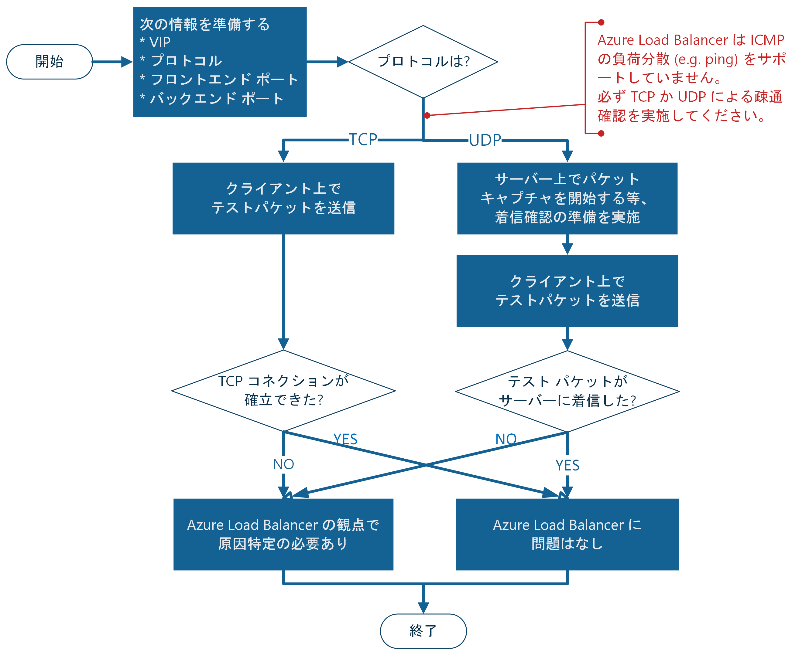

Azure Networking テクニカル サポートの山口です。

Azure Load Balancer (ALB) はワークロードを複数の Azure VM / VMSS に負荷分散するサービスで、最も利用されている Azure サービスの一つです。利用数が多い分、ALB を経由するエンドノード間の通信に問題が生じたといったトラブルもよくお問い合わせいただきます。そこで、そうしたトラブルにおいて、ALB の観点で原因箇所を切り分けるスコーピングの方法についてご紹介したいと思います。

<!-- more -->

## 要約

- トランスポート層 (L4) レベルで接続性が確保できていれば Auzre Load Balancer として問題はありません。
- 例えば TCP の負荷分散規則であれば `nc`、`telnet`、`PsPing`、`Test-NetConnection` 等で TCP コネクションが確立出来るかみれば十分です。
- L4 の接続性が確認できない場合は、Azure Load Balancer の構成状況に問題があります。次の公式ドキュメントやブログ記事等を参考に原因箇所を特定してください。
  - [Azure Load Balancer のトラブルシューティング | Microsoft Docs](https://docs.microsoft.com/ja-jp/azure/load-balancer/load-balancer-troubleshoot)
  - [ロードバランサー経由での通信ができない場合のチェックポイント | Microsoft Docs](https://docs.microsoft.com/ja-jp/archive/blogs/jpaztech/loadbalancer-troubleshooting)
  - [Azure ロードバランサー利用時の注意点 | Microsoft Docs](https://docs.microsoft.com/ja-jp/archive/blogs/jpaztech/azurelb-tips)

## はじめに

 Azure Load Balancer に関わるトラブルを解決する際には、**Azure Load Balancer は L4 ロードバランサーである**ということを意識しておく必要があります。

* [Azure Load Balancer の概要 - Azure Load Balancer | Microsoft Docs](https://docs.microsoft.com/ja-jp/azure/load-balancer/load-balancer-overview)
  
> Azure Load Balancer は、開放型システム間相互接続 (OSI) モデルのレイヤー 4 で動作します。 

立ち位置を明確にする為に他の負荷分散サービスと比べてみると、Azure の負荷分散サービスで関与できるネットワーク レイヤーは、それぞれ以下の通りです。

* **Trarffic Manager**: DNS レベルの負荷分散装置。DNS による名前解決時に負荷分散に関与できる。
* **Azure Load Balancer**: トランスポート層 (L4) の負荷分散装置。UDP または TCP のフローを、適当なバックエンド サーバーに分散するのが仕事。
* **Application Gateway**: アプリケーション層 (L7) の負荷分散装置。HTTP/S のセッションを、適当なバックエンド サーバーに分散するのが仕事。

なお、負荷分散サービスの比較は、以下のドキュメントでより詳しく説明されています。これらのサービスの比較にご興味があれば、併せてご確認ください。

* [Azure で負荷分散サービスを使用する | Microsoft Docs](https://docs.microsoft.com/ja-jp/azure/traffic-manager/traffic-manager-load-balancing-azure)

「503 エラーが表示されるが、Azure Load Balancer に問題はないか調査してほしい」といったお問い合わせをいただくことがありますが、<span style="color: #d00000">Azure Load Balancer はあくまで L4 の接続性を担保するのが責務であり、その上のレイヤーである HTTP の応答に関与することはありません</span>。

Azure Load Balancer は TCP ペイロードに関与しないため、例えば HTTP の 50* 系ステータス コードのレスポンスを返すことも、`X-forwarded-for` ヘッダを書き換えることもありません。HTTP (アプリケーション層) で何か不具合が出ている場合は、バックエンド サーバーより後段のエンティティを対象に原因調査するのが良いでしょう。

## スコーピング: 問題の切り分け

この記事の最大の目的です。Azure Load Balancer を経由するシステムに問題がある場合の **切り分け (スコーピング) 方法**について紹介していきたいと思います。具体的には「Azure Load Balancer に関連する箇所で問題があるか」を切り分けます。

答えを言ってしまうと、Azure Load Balancer に問題があるか切り分けるには **L4 の接続性 (connectivity)** を確認するだけで十分です。

切り分けのフローチャートを作成したので、まずは下図を基に全体像を把握していただければ幸いです。




### 準備

切り分けに必要な情報は以下の通りです。

- `<vip>`: フロントエンドで待ち受ける仮想 IP アドレス
- `<protocol>`: VIP で待ち受ける L4 プロトコル (TCP/UDP)
- `<port>`: VIP で待ち受けるポート番号
- `<backend-port>`: 負荷分散された後、バックエンド サーバーが受け取る (NAPT 後の) ポート番号

加えて、テストパケットを送信するクライアントも用意する必要がありますが、クライアントと Azure Load Balancer の間には余計なネットワーク装置 (e.g. Firewall) を置かないことが鉄則です。どうしてもそのようなクライアントが準備出来ない場合は、被疑箇所は Azure Load Balancer だけではなく、中間のネットワーク装置まで含めた検証となることを必ず意識してください。

なお、クライアントには対象の Azure Load Balancer のバックエンド サーバーではないものを選択してください。というのも、内部ロードバランサーは自分自身に負荷分散されたパケットはドロップされる動作となっている為です。

* [Azure Load Balancer のトラブルシューティング | Microsoft Docs](https://docs.microsoft.com/ja-jp/azure/load-balancer/load-balancer-troubleshoot#cause-4-accessing-the-internal-load-balancer-frontend-from-the-participating-load-balancer-backend-pool-vm)

> 副作用として、バックエンド プール内の VM からの送信フローが、そのプール内の内部ロード バランサーのフロントエンドへのフローを試み、"かつ"、それ自体にマップバックされている場合、フローの 2 つのレッグは一致しません。 これらは一致しないため、フローは失敗します。 フローが、フロントエンドへのフローを作成したバックエンド プール内の同じ VM にマップバックしなかった場合、フローは成功します。

### TCP の負荷分散規則

負荷分散プロトコルが TCP の場合、3-way handshaking が確認できれば疎通できていると見なせるので、切り分けはクライアントで完結します。

例えば次のコマンドを実行して、TCP コネクションが確立できるか確認します。

```
# Linux
[client]# telnet <vip> <port>
[client]# curl -v telnet://<vip>:<port>
[client]# nc -v <vip> <port>

# Windows (powershell)
PS C:\client> Test-NetConnection <vip> -Port <port>
PS C:\client> PsPing -t <vip> <port>
```

- [telnet(1): user interface to TELNET protocol - Linux man page](https://Linux.die.net/man/1/telnet)
- [nc(1): arbitrary TCP/UDP connections/listens - Linux man page](https://Linux.die.net/man/1/nc)
- [Test-NetConnection | Microsoft Docs](https://docs.microsoft.com/en-us/powershell/module/nettcpip/test-netconnection?view=win10-ps)
- [PsPing - Windows Sysinternals | Microsoft Docs](https://docs.microsoft.com/en-us/sysinternals/downloads/psping)

Linux と Windows のいずれの場合でも、TCP コネクションが connected になれば L4 の疎通性に問題はありません。

### UDP の負荷分散規則

一方で、UDP の場合は、クライアントからの通信に必ずしも応答 (ACK) が返されるとは限らないため、サーバー側で着信を確認する必要があります。

クライアント側では例えば以下のようなコマンドで、テスト パケットを送信出来ます。

```
# Linux
[client]# echo -n "test message" | nc -u <vip> <port>

# Windows (powershell)
PS C:\client>
function Test-Udp($vip, $port) {
    $client = New-Object System.Net.Sockets.UdpClient
    $client.Connect($vip, $port)
    $encoding = New-Object System.Text.ASCIIEncoding
    $bytes = $encoding.GetBytes("test message")
    $client.Send($bytes, $bytes.Length)
    $client.Close()
}
Test-Udp <vip> <port>
```

サーバー側でテスト パケットが着信していることを確認するには、アクセスログを確認する、モックサーバーを利用する、パケットをキャプチャする、といった選択肢が選べます。ここでは、最も汎用性の高いパケット キャプチャによる確認方法を簡単に紹介します。

```
# Linux
[server]# sudo tcpdump -i any -nN udp and port <backend-port>

# Windows (powershell with administrator mode)
PS C:\server> netsh trace start report=no capture=yes tracefile=%USERPROFILE%\Desktop\trace.etl
PS C:\server> netsh trace stop
```

`tcpdump` の場合は、標準出力に対象のパケットが表示できれば L4 疎通性は問題ありません。また、`netsh` の場合は、採取したトレース ファイル (デスクトップに生成される `trace.etl`) に対象のパケットが含まれていたら L4 疎通性に問題ありません。

## ネクスト アクション

上記の切り分けで L4 の疎通性が得られない場合、Azure Load Balancer の構成状況に問題があります。次に紹介するブログ記事や公式ドキュメントを参考に、原因箇所の特定をご実施ください。

- [Azure Load Balancer のトラブルシューティング | Microsoft Docs](https://docs.microsoft.com/ja-jp/azure/load-balancer/load-balancer-troubleshoot)
- [ロードバランサー経由での通信ができない場合のチェックポイント | Microsoft Docs](https://docs.microsoft.com/ja-jp/archive/blogs/jpaztech/loadbalancer-troubleshooting)
- [Azure ロードバランサー利用時の注意点 | Microsoft Docs](https://docs.microsoft.com/ja-jp/archive/blogs/jpaztech/azurelb-tips)

一方で、Azure Load Balancer に問題がなければ、多くの状況でサーバーで動作しているアプリケーションがエラー原因です。正確に言えば、OS のネットワーク スタック以上のレイヤーで、構成が間違っているか予期しない問題が起きている可能性があります。

本切り分けの検証結果や、現在の状況、目標とする状態などを OS やミドルウェア/アプリケーションのベンダー様とご共有いただき、さらに原因調査を進めてください。

---

※本情報の内容（リンク先などを含む）は、作成日時点でのものであり、予告なく変更される場合があります。
